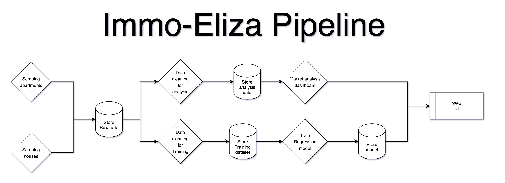

# immoeliza-airflow
Automated scraping - storing - model training using Airflow from a real estate website in order to predict the price of apartments and houses to sell in Belgium.

### Project' structure

project/  
├─ data/  
│  └─ properties.csv  
├─ utils/  
│  └─ main_scraper.py  
│  └─ details_scraper.py  
├─

## How does it work?

### 1. Building the foundations

**1.1. Scraping the first dataset**  

The first step consists in building a first dataset, as complete as possible. Therefore, we want to scrape the integrity of the properties to sell available on the website. This means that **the [main scraper](utils/main_scraper.py) will run a first time, without checking duplicates** (wheather a property has already been scraped or not).  

The scraper will fetch: the property link - the type (house, apartment, etc.) - the location - the price.

The scraper is **flexible** on order to make it more **robust over time**. It is also intentionaly slowed in order to avoid overlaoding the website we are scraping. Furthermore, note that after reaching 1000 links scraped, the website keeps repeating the links. I therefore adapted the scripts in order to scrape by [locality](data/code-postaux-belge.csv) and avoid this 1000 links limitation.  

_Note that the process can be speed up using parallel processing._   

As we scraped the list of properties, we only got basic info. We now need **additional info** that are being fetched by a [second scraper](utils/details_scraper.py). This scraper opens each link that has been scraped in the first scraper and gets missing details such as the **size of the property, the amount of bedrooms, etc.** 

**1.2. Cleaning the dataset**
  
k

### 2. Storing 

"""
For daily scraping:
Everyday: copy the dataset before modifying it for safety. And delete automatically the one from the previous day. 
"""

### 3. Setting & training the model

### 4. Dashboard creation

### 5. Fetching - training: a continuous process

As the webpage shows the most recent added properties first, I adapted the main scraper so that it skips the link already existing in the dataset, and runs untill it meets 20 links in a row that have already been fetched. This leaves some place for misordered data.
Once the first scraper has run, the second scraper takes over. Data is then cleaned again and used to retrain the model.  

**Technically, how does it work?**

Using Airflow: creating DAGs

A [DAG](https://airflow.apache.org/docs/apache-airflow/stable/core-concepts/dags.html) is _a model that encapsulates everything needed to execute a workflow_. Some DAG attributes include the following:
- Schedule: When the workflow should run.  
- Tasks: tasks are discrete units of work that are run on workers.  
- Task Dependencies: The order and conditions under which tasks execute.  
- Callbacks: Actions to take when the entire workflow completes.
- Additional Parameters: And many other operational details.

### To do
- Scraper les links de chaque property pour ajouter les données nécessaires : 

- Ajouter ces données directement dans le csv

- Relancer le scraper sur liens

- Ajouter une verification pour scraper que les nouveaux liens ensuite. 

- Comment intégrer airflow & docker là-dedans ?
- Quid du storage ? 

- Clean data & store

Ensuite : créer 2 chemins:
1. Store for analysis : Market analysis dashboard (with Streamlit? or more developed if time)
2. Create training set and retrain on new data every day. -- store model -- integrate the new trained model -- dashboard

## A lightweight alternative, using Render's free plan

The first pipeline version proposed here above comes with a cost: either you run everything locally (but your computer has to be on in order for it to work), either you work with a server (which can quickly becone costly).

A free leveregable alternative would be using Render, which offers a fee plan:

1. Render Cron Jobs → schedule your scraper Python script to run nightly.  
Example: “Run python scraper.py every day at 02:00.”

2. Render PostgreSQL → store your scraped data in a proper DB instead of CSV.  
3. Streamlit App on Render → free web service to serve your dashboard/model.

That way:

- Scraper runs every night, fetches new data, inserts into Postgres.  
- Your model app reads from Postgres and stays fresh.  
- You avoid Airflow’s overhead and stay inside Render Free.

This comes of course with some limitations and would require refactoring the code to match Render's free plan. 